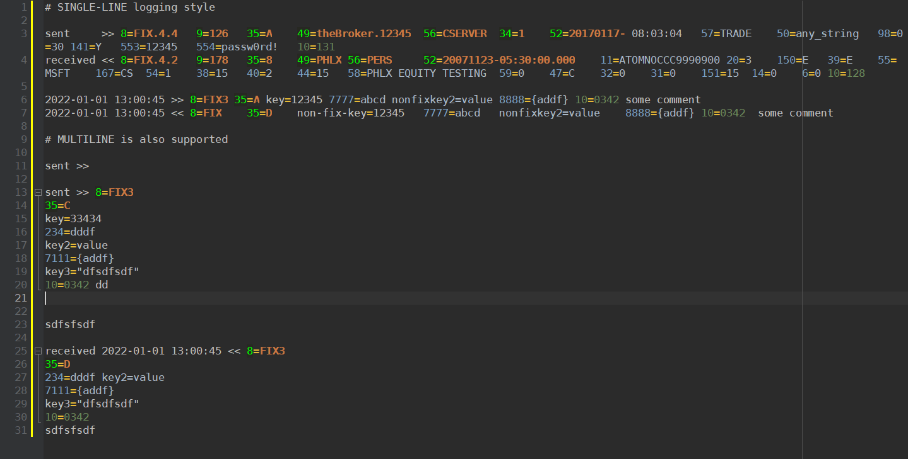

# cudatext-lexer-fix-protocol

Lexer for FIX (Financial Information eXchange) protocol message.

Lexer has been created with the intent to display log files with each line starting with some arbitrary data (usually a
timestamp, thread name, etc.) followed by the FIX message itself.

Supported styles:

* Log-message (any text from the start of the line until the beginning of FIX message header "8=...")
* Key-Header (tags: 8, 9, 34, 35, 49, 52, 56)
* Value-Header
* Key-Body (tags: any numeric tag apart from Header and Trailer tags)
* Value-Body
* Key-Trailer (tags: 10)
* Value-Trailer
* Separator (Hex 0x01 unprintable char as specified by FIX protocol)
* Punctuation

Recommended settings:
`unprinted_replace_to_code = 09` to bring more visual separation between tags.

CudaText with Darcula theme and sample log containing some FIX messages:

## Installation

- copy `lexlib/*` to `data/lexlib` directory of CudaText
- restart CudaText and select the `FIX Message` lexer in settings